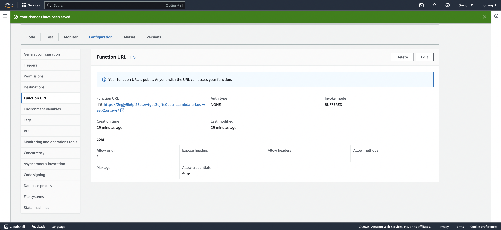

# Serverless Using AWS Lambda
My project 4 utilizes the AWS Lambda to deploy my FastApi project. This is how I achieve the serverless hosting.

The url is https://2egjy5k6pi26eczwtgoc3ojfte0uucnt.lambda-url.us-west-2.on.aws/

# Steps to deploy on AWS Lambda
- First install all the dependencies into the lib by using the following command

    pip install -t -lib -r requirements.txt

- Then create a zip file of all the dependencies we just installed

    cd lib; zip ../lambda_function.zip -r .

- Add the main.py and books.json to the zip file

    zip lambda_function.zip -u main.py
    
    zip lambda_function.zip -u books.json

- We can upload this zip file to AWS Lamda

# Testing thr AWS Lambda function

- Create new test using API-Gateway-AWS-Proxy, configure the Event Json

- Then I have to test and verify that the result is correct

- Configure the function url so that people can access through the url: https://2egjy5k6pi26eczwtgoc3ojfte0uucnt.lambda-url.us-west-2.on.aws/

# API Path Parameters

- "/" 

    This direct you to the home page

- "/random-one" 

    This gives you the information of a random book in the bookshop

- "/booklist" 

    This shows you all the books information in bookshop

- "/book_by_index/{index}" 

    This returns you the corresponding book of the given index

- "/add-book" 

    Use curl to add a book and provide book information. You can follow the following way.

You can the book is successfully added on the url: https://2egjy5k6pi26eczwtgoc3ojfte0uucnt.lambda-url.us-west-2.on.aws/booklist

# Usage
1. To test the application, use the following endpoint URL in a web browser or any HTTP client.

    https://2egjy5k6pi26eczwtgoc3ojfte0uucnt.lambda-url.us-west-2.on.aws/

2. You can also test the application locally by running the following command:

    uvicorn main:app --reload

# Reference

https://www.youtube.com/watch?v=RGIM4JfsSk0